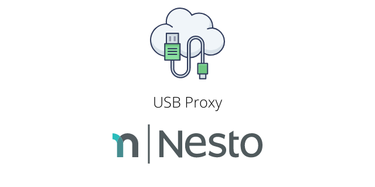

USB Proxy for Raspberry Pi (armhf)   
========

<p align="center">
  
</p>


Heads Up!
------
This project is currently being refactored by Nesto.   
If you want to participate, feel free to reach out!
 
Martin Löper `<martin.loeper@nesto-software.de>`

Mission
-------


Install
-------

In order to install USBProxy on your Raspberry Pi, please use the following snippet.
You must add AWS credentials at the top of the file in advance.

```bash
#!/bin/bash
set -e

# set AWS credentials to access S3 bucket which hosts the debian repository
ACCESS_KEY_ID=
SECRET_ACCESS_KEY=

REGION=eu-central-1
BUCKET=nesto-debian-repo-devel
GPG_KEY_ID=92F91ABA4816493E
PKG_NAME=nesto-usbproxy
DISTRIBUTION=main   # main or nightly

sudo apt-get update
sudo apt-get install apt-transport-s3
echo -e "AccessKeyId = '$ACCESS_KEY_ID'\nSecretAccessKey = '$SECRET_ACCESS_KEY'\nRegion = '$REGION'\nToken = ''" > /etc/apt/s3auth.conf
echo "deb s3://$BUCKET $DISTRIBUTION aws" >> /etc/apt/sources.list
gpg --keyserver keys.openpgp.org --receive-key "$GPG_KEY_ID"
gpg --export --armor "$GPG_KEY_ID" | apt-key add -
sudo apt-get update
sudo apt-get install $PKG_NAME
```

```bash
#!/bin/bash
set -e

FILE=/tmp/nesto-usbproxy-latest.deb

curl -s https://api.github.com/repos/nesto-software/USBProxy/releases/latest \
| grep "browser_download_url.*deb" \
| cut -d : -f 2,3 \
| tr -d \" \
| wget -qi - -O "$FILE"

sudo dpkg -i "$FILE"
```

| Method    | Command                                                                                           |
|:----------|:--------------------------------------------------------------------------------------------------|
| **curl**  | `sh -c "$(curl -fsSL https://raw.githubusercontent.com/nesto-software/USBProxy/master/scripts/install-from-release.sh)"` |
| **wget**  | `sh -c "$(wget -O- https://raw.githubusercontent.com/nesto-software/USBProxy/master/scripts/install-from-release.sh)"`   |

GPG
---------

#### Add our key to your keychain!
<a href="https://keyoxide.org/F1C6636C27019FD0D29307DEAE25CBF30C0DDB0C" rel="Nesto Cloud Operations"></a> 

   

<a align="left" href="https://www.openkeychain.org/"><b>Download OpenKeychain</b></a>